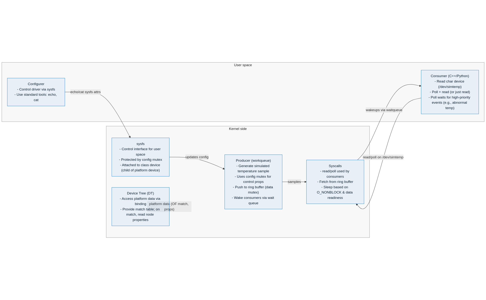

# Design

## Block Diagram

## Description

### Kernel Side

- Producer (workqueue):
  - Generates a simulated temperature sample based on the control properties (protected by a config mutex).
  - Pushes it to the ring buffer (protected by a data mutex).
  - Wakes up any sleeping thread (consumers via wait queue).

- Syscalls:
  - `read` and `poll` are called by the consumers.
  - Fetch data from the ring buffer.
  - Sleep depending on the non-blocking flag and data readiness.

- sysfs:
  - Provides the control interface for user-space programs.
  - Protected by the config mutex.
  - Attached to the class device (child of the platform device).

- Device Tree (DT):
  - Provides access to the platform data via a device tree binding.
  - The kernel handles most of the device tree processing; provide a match table, and if a match is triggered, obtain the properties of that node.

### User Space

- Consumer:
  - A program (C++/Python) consumes data by reading the character device (data path).
  - This can be done using polling and reading (or just reading).
  - The polling interface allows waiting for high-priority events (such as abnormal temperature).

- Configurer:
  - Uses sysfs to control the driver behavior, with standard commands such as `echo` and `cat`.

## Synchronization and Context

- A mutex is used instead of spinlocks because the consumer can block (sleep), requiring a process context for synchronization.
- The choice of a workqueue follows the same premise; a timer runs in atomic context, whereas the workqueue provides process context suitable for sleeping operations.
